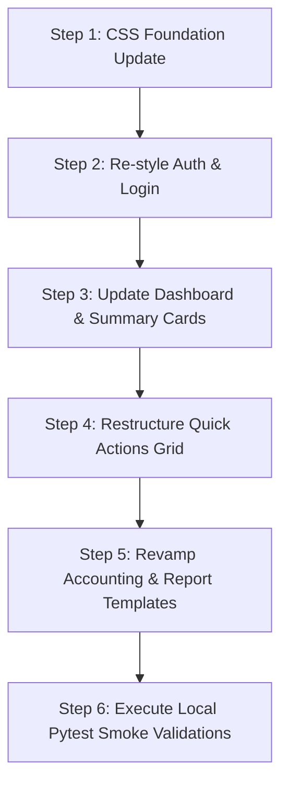

# GruhaMitra UI/UX Review & Improvement Suggestions

**Date:** 2026-05-25  
**Target Environment:** [gharmitra.vercel.app](https://gharmitra.vercel.app/dashboard) (Live Production)

---

## 1. Executive Summary

This document presents a comprehensive UI/UX audit and enhancement proposal for the live **GruhaMitra** housing society management frontend.

While the application is fully functional—with completed integrations for society onboarding, member dashboards, complaints, billing, and accounting modules—the visual styling remains close to a basic blueprint. To deliver a unified, premium SaaS experience that matches the high-fidelity design standards of **LegalMitra** and **MandirMitra**, several core enhancements are recommended.

### 1.1. Target PWA Dashboard Design Mockup


---

## 2. Current State vs. Target State Analysis

### 2.1. Login Experience
- **Current State:** A clean login card containing the orange GruhaMitra house-and-calculator logo, basic email/password fields, and plain links for registration/onboarding options. The PWA installation banner (*"Install GruhaMitra"*) is displayed as a simple floating card.
- **Target State (Premium UX):**
  - **Dynamic Backgrounds:** Introduce a split-pane layout with a high-fidelity ambient background or animated architectural line-art illustration on the left panel, and a clean, centered login form on the right.
  - **Glassmorphism:** Apply a frosted-glass backdrop filter on the auth card with a subtle gradient border.

### 2.2. Dashboard Summary Cards
- **Current State:** Metrics (`SOCIETY BALANCE`, `THIS MONTH BILLING`, `DUES PENDING`, `COMPLAINTS OPEN`) are displayed as plain static text blocks with values underneath (e.g., `0`). There are no icons, borders, or hover states.
- **Target State (Premium UX):**
  - **Interactive Micro-Cards:** Wrap each metric in a floating card with a subtle shadow and thin border.
  - **Custom SVG Icons:** Add themed icons with colored background circles (e.g., green wallet for balance, blue invoice for billing, amber alert for dues, red chat-bubble for complaints).
  - **Vibrant Hover Transitions:** Introduce scale and shadow lift transitions on hover.

### 2.3. Quick Actions Grid
- **Current State:** A 3x4 grid of identical plain rectangular buttons (Accounting, Generate Bills, Members, etc.). The design feels uniform and lacks visual hierarchy.
- **Target State (Premium UX):**
  - **Icon-Driven Badges:** Replace the text-only buttons with square card badges featuring custom icons at the top and descriptive labels underneath.
  - **Visual Hierarchy:** Use distinct border gradients or weight styling for primary frequent tasks (like *Accounting* and *Generate Bills*) vs. administrative settings.

### 3.4. Accounting & Report Modules
- **Current State:** 
  - The Chart of Accounts is rendered as a flat, plain table with basic "Edit Name" buttons.
  - The generated Trial Balance report prints summary statistics (As On Date, Total Debit, Total Credit, Difference) inline, separated by vertical pipe characters (`|`), followed by a flat list of accounts.
- **Target State (Premium UX):**
  - **Categorized Tree View:** Group the Chart of Accounts dynamically by type (Assets, Liabilities, Equity, Income, Expenses) in collapsible accordion containers.
  - **Styled Report Summaries:** Replace the pipe-separated text (`|`) with a cohesive summary dashboard showing colored cards (e.g., green for a balanced ledger, red if there is a difference).
  - **Traditional Ledger Styling:** Format accounting ledgers with clean double-column divider layouts to represent standard double-entry accounting pages.

---

## 3. Recommended Design Tokens (Vanilla CSS)

To unify GruhaMitra with the rest of the SanMitra digital ecosystem, we propose implementing the following design tokens in `index.css`:

```css
:root {
  /* Color Palette - Warm Modern Housing Theme */
  --color-primary: hsl(28, 90%, 55%);       /* Warm Orange accent */
  --color-primary-dark: data-color-primary-hover; /* HSL(28, 95%, 45%) */
  --color-accent: hsl(200, 85%, 45%);        /* Sky Blue for notifications */
  --color-bg-dark: hsl(220, 25%, 10%);       /* Sleek Dark Mode Background */
  --color-card-dark: hsl(220, 20%, 15%);     /* Glassmorphism base */
  
  /* Typography */
  --font-family: 'Outfit', 'Inter', system-ui, -apple-system, sans-serif;
  
  /* Borders and Shadows */
  --border-radius-lg: 16px;
  --border-radius-md: 10px;
  --box-shadow-premium: 0 10px 30px -10px rgba(0, 0, 0, 0.3);
  --box-shadow-hover: 0 20px 40px -15px rgba(0, 0, 0, 0.5);
  
  /* Transitions */
  --transition-smooth: all 0.3s cubic-bezier(0.25, 0.8, 0.25, 1);
}
```

---

## 4. Step-by-Step Implementation Sequence

According to the **Staged E2E Plan**, GruhaMitra E2E validation and integration should occur *only after* MandirMitra passes its final staging reviews. Once that gate opens, the UI/UX changes should be rolled out in this sequence:



1.  **Step 1:** Establish the shared design tokens in `frontend/shared/app-shell.css` to enable consistent coloring across modules.
2.  **Step 2:** Refactor the login interface with a modern split-pane design and custom CSS transitions.
3.  **Step 3:** Convert the raw text blocks on the dashboard into modern, shadow-hover cards with custom SVG icons.
4.  **Step 4:** Restructure the Quick Actions grid into a layout using distinct iconography.
5.  **Step 5:** Revamp the Trial Balance and ledger outputs in the Reports module to use clean tables and card components.
6.  **Step 6:** Run the local pytest verification suites (e.g. `tests/test_gruhamitra_frontend_api_compat.py` and `tests/test_gruhamitra_security_isolation.py`) to confirm zero regressions in module security or tenant isolation.

---

## 5. Suggested Website and App Visual Assets

These premium design assets have been generated to serve as high-fidelity visual targets and production assets for the landing page and mobile application layout:

### 5.1. Hero Landing Page Graphic
Displays a modern eco-friendly residential complex with clean, overlaying dashboard statistics, representing "Your Society, Digitally Simplified":


### 5.2. Resident Portal Mobile App Mockup
Displays a high-fidelity mobile app layout for residents, featuring visitor check-in QR codes, mobile maintenance payments, and a unit dashboard:


---

*Report prepared by Antigravity.*
